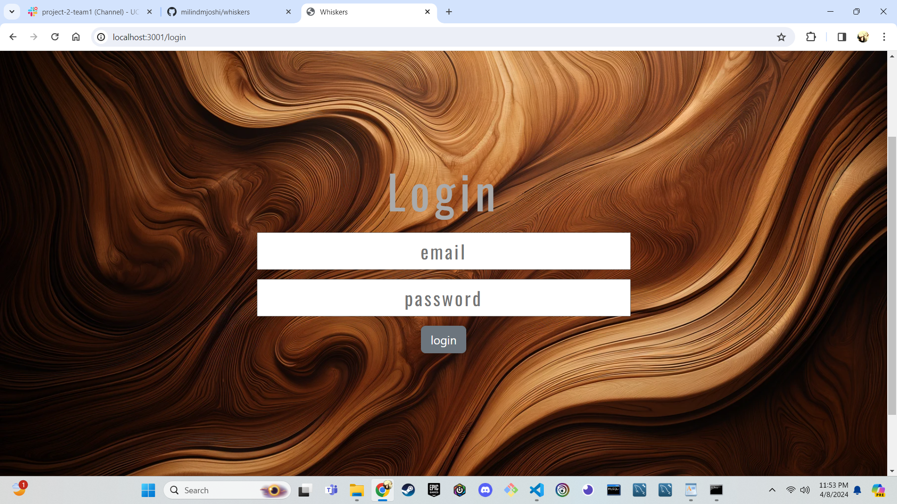

# Whiskers Whiskey enthusiast application

## Table of Contents
1. [Introduction](#introduction)
2. [Features](#features)
3. [Installation](#installation)
4. [Usage](#usage)
5. [Admin Functions](#admin-functions)
6. [Screenshots](#screenshots)
7. [Contributing](#contributing)
8. [License](#license)

---

## Introduction
Welcome to the Whiskers README! This application is designed to help whiskey enthusiasts find, rate, and store their favorite whiskeys. As an added feature, administrators have the ability to manage the whiskey database by adding or deleting entries.

---

## Features
- **User Features:**
  - Search for whiskeys by name.
  - Rate whiskeys based on personal preference.
  - Store favorite whiskeys to profile for future reference.

- **Admin Features:**
  - Add new whiskeys to the database.

---

## Installation
To install the Whiskey Application, follow these steps:
1. Clone the repository from GitHub: `git clone https://github.com/milindmjoshi/whiskers.git`
2. Navigate to the project directory: `cd whiskers`
3. make sure to use the schema.sql in mySQL to create database
4. open in a code editor and then Install dependencies: `npm install` and then seed the database with `npm run seed`
5. After setting up the MySQL database with provided schema and sample data, run in external terminal `node server.js`.
6. Navigate to localhost:3001/login to begin interaction with the application

---

## Usage
Once the application is running, users can:
- Search for whiskeys using the search functionality.
- Rate whiskeys by clicking on the rating tab 1-5.
- Store favorite whiskeys by adding them to their personal collection stored to their profile.

---

## Screenshots

---

## Contributing
Contributions to the Whiskey Application are welcome! To contribute:
1. Fork the repository.
2. Create a new branch for your feature or bug fix: `git checkout -b feature/your-feature-name`
3. Make your changes and commit them: `git commit -m 'Add new feature'`
4. Push to the branch: `git push origin feature/your-feature-name`
5. Submit a pull request.

---

## License 
This project is currently licensed under the MIT License 

---

Feel free to reach out to the project maintainers with any questions or feedback. Happy whiskey tasting! 
